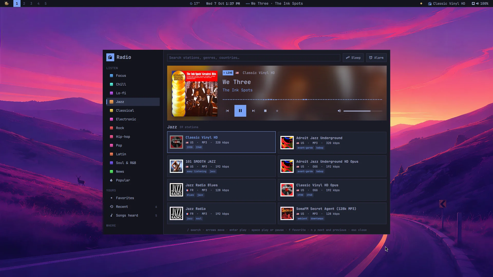
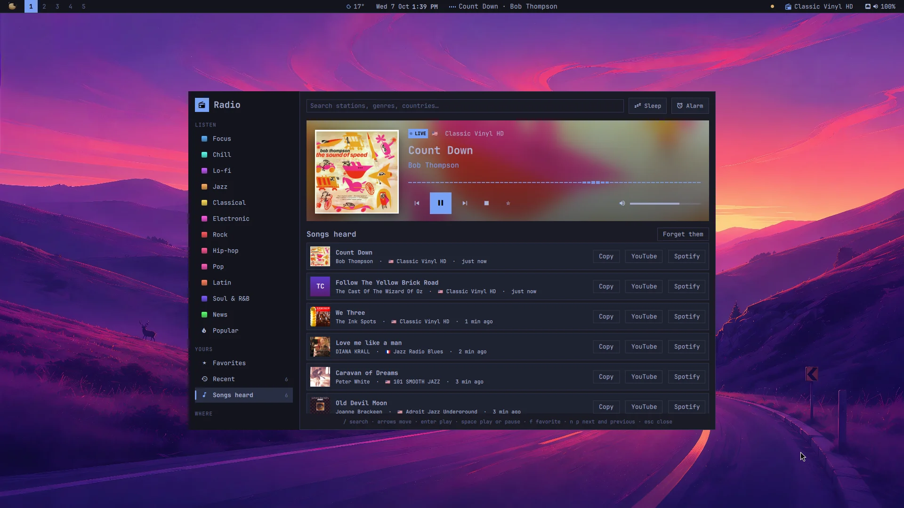
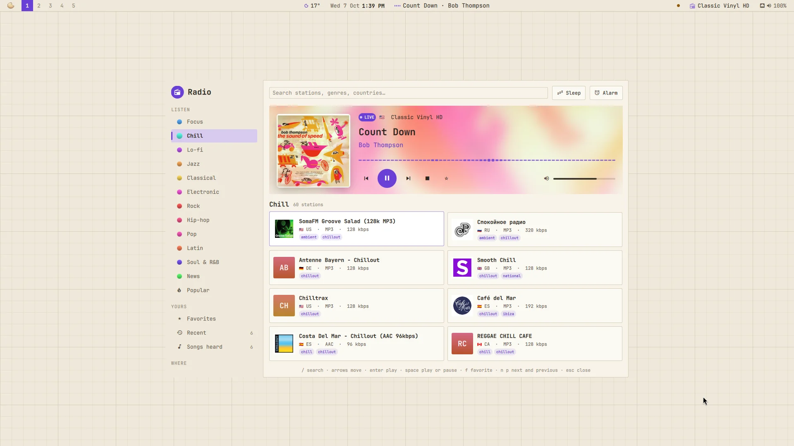

# Radio

A plugin for [Mazapan](https://mazapan.dev), listed in its [plugin registry](https://mazapan.dev/plugins/radio/).



Live radio from all over the world, found the way you think of it: by
mood first ("something to focus", "jazz"), then by country or by name. And
the song playing is more than a line of text: its cover, its colors, and a
list of every song you heard, to find it again.

- **Moods first**: Focus, Chill, Lo-fi, Jazz, Classical, Electronic, Rock,
  Hip-hop, Pop, Latin, Soul & R&B, News, and what's popular worldwide.
  Then **near you** (your country) and **the world**, every country with
  its flag. Or search by name, genre or country.
- **Each song's cover.** Stations say what they play ("Artist - Title",
  or "Title by Artist"); the cover is found for it, and the top of the
  panel takes its light. A station's own tagline isn't taken for a song,
  and a station that says title and artist the wrong way round is set
  right.
- **The songs you heard**, newest first, with their covers, the station
  and when: copy one, or find it on YouTube or Spotify.
- **Stations as cards**: their logo (or their initials on a color of their
  own), their country's flag, codec and bitrate, their genres. Only
  stations that worked at the directory's last check.
- **Favorites and recent stations**; next and previous through the list
  you played from.
- **A sleep timer** (15, 30, 60, 90 minutes; the last 30 seconds fade
  out) and **an alarm** that wakes you up with your last station, its
  volume rising over a minute (it plays even with the panel closed).
- **It plays on its own**: close the panel, it keeps playing; the media
  keys, the bar and the Control Center's player see it (MPRIS), with the
  song and its cover, in [Playback](https://github.com/rick-dev-creator/mazapan-playback)
  or [Now Playing](https://github.com/rick-dev-creator/mazapan-now-playing)
  too.
- **In the bar**, while one is on: its mark and the station. A click
  opens the panel, a right click plays or pauses, a middle click goes to
  the next station, the wheel changes its volume.
- **From the palette**: "Radio: jazz", "Radio: focus", "Radio: lo-fi",
  "Radio: news", "Radio: my favorites", "Radio: a random station", "Radio:
  stop", without opening anything.



`SUPER + ALT + R` opens it. In the panel: `/` searches, the arrows move
through the cards, Enter plays, Space plays or pauses, F keeps a favorite,
N and P go to the next and previous station, Esc clears the search or
closes (so does a click outside).



## What it reaches and why

- **[Radio Browser](https://www.radio-browser.info/)**, the community's
  directory of stations: the lists you open, and one "click" counted for a
  station when you play it, as the directory asks of players. It's told
  the plugin's name as its user agent; nothing about you.
- **The stations themselves**: their stream (played by mpv) and their
  logo. Before one plays, its address and every redirect are checked:
  a stream that leads to this computer or its local network is refused.
  Streams over plain http aren't encrypted.
- **iTunes Search** (itunes.apple.com), for each song's cover: the song's
  artist and title, nothing else. Off with the "Song covers" setting.
- **cava**, while the panel is open and something plays: it listens to
  what goes out of the speakers to draw the bars. Nothing is recorded or
  sent anywhere.
- **What it keeps**: `~/.local/state/mazapan/radio/library.json`
  (favorites, recent stations, the last 200 songs heard, the volume, the
  alarm) and the covers in `~/.cache/mazapan/radio`. "Forget them" clears
  the songs heard.
- **What it runs**: its player, `~/.local/share/mazapan/bin/radio`, as a
  user service (`mazapan-radio.service`), started when first needed; the
  alarm as a user timer (`mazapan-radio-alarm.timer`). With the plugin off,
  both are stopped.
- **Files it writes**: its part of the shell (`components/radio/`, the
  bar's widget, the panel), its key in Hyprland, and its settings, read as
  they change.

## Install

In Mazapan, the Plugins panel (`SUPER + SHIFT + P`) lists it under the
community's: its page shows what it can do before you install it. Or:

```sh
mazapan plugins add radio
mazapan apply
```

Updates come through the registry: `mazapan plugins update radio`, or the
Updates panel, asking again only for anything new it would be able to do.

## Develop

```sh
git clone https://github.com/rick-dev-creator/mazapan-radio
mazapan plugins dev mazapan-radio     # applied again on every save
mazapan plugins check mazapan-radio   # every theme, every language, before a release
journalctl --user -u mazapan-radio    # what the player says
```

A release is a tag, `vX.Y.Z`, the same as `version` in plugin.toml; the
registry lists it once it passes its checks.

## License

MIT
